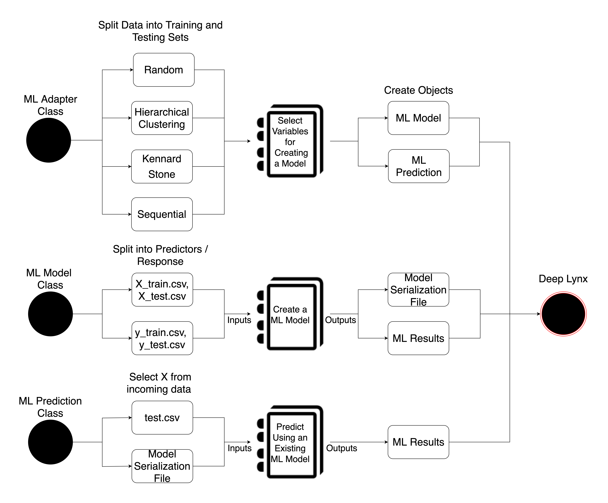

# Deep Lynx Machine Learning

The Deep Lynx Machine Learning (ML) Adapter is a generic adapter that receives data from Deep Lynx, programmatically runs the machine learning, and imports the machine learning data into [Deep Lynx](https://github.com/idaholab/Deep-Lynx). Then, Jupyter Notebooks can be customized according to the project for building the machine learning models and performing prediction analysis of incoming data using an existing model.

This project is a [Deep Lynx](https://github.com/idaholab/Deep-Lynx) adapter that utilizes the Deep Lynx event system. After this application registers for events, received events will be parsed for data to be used in machine learning processes. 

## Overview of the Deep Lynx Machine Learning Adapter

The Deep Lynx Machine Learning (ML) Adapter is a generic adapter that receives data from Deep Lynx, programmatically runs the machine learning, and imports the machine learning data into Deep Lynx. Jupyter Notebooks, shown as notebook icons in the below diagram, can be customized according to the project for variable selection, building the machine learning models, and prediction analysis of incoming data using an existing model. User guides were created with each of these customizable sections for the end user. The Jupyter Notebook platform was chosen to allow the end user to pick a kernel in any available language including Python, R, Matlab, Fortran, Perl, C++, Java, and many more.  
 
The software has three generic classes called the ML Adapter, ML Model, and ML Prediction that pre and post process the data. With the ML Adapter class, the data is split into training and testing sets where the user can choose to split the data via random, hierarchical clustering, Kennard Stone, or sequential methods. Then, a Jupyter Notebook is used to select the independent and dependent variables for creating a model and writes this information to a json file. This file is used to instantiate multiple model and prediction objects. 
 
Next, the ML Model class splits the training and testing sets further into predictors and response and writes the data to csv files (X_train, X_test, y_train, y_test). These files are temporary and are only used in the Jupyter Notebook. The user provides a Jupyter Notebook for creating a machine learning model tailored to their project that produces a model serialization file and a file of the machine learning results. The model file and machine learning results are then imported in Deep Lynx for storage. 
 
Lastly, the ML Prediction class selects the predictors from the incoming data and writes the data to a test csv file. Using the existing model serialization file stored in Deep Lynx, a Jupyter Notebook makes a prediction on the incoming data and writes the results to a file. The machine learning results are imported into Deep Lynx for use in other applications such as a UI or intelligent control of a live asset.  




## Getting Started

1. Setup your environment. See the `Environment Setup for Python` or `Environment Setup for R` sections.
2. Look at the README sections in the `variable_selection`, `model`, and `prediction` folders.
3. Look at the `Environment Variables (.env file)` section.
4. Create Jupyter Notebooks in directories `variable_selection`, `model`, and `prediction` accordingly.
5. Setup your `.env` file. 
5. Run the project.

Logs will be written to a log file, stored in the root directory of the project. The log filename is set in `adapter/__init__.py` and is called `MLAdapter.log`.

<details>
  <summary>Environment Setup for Python</summary>

* Complete the [Poetry installation](https://python-poetry.org/) 
* All following commands are run in the root directory of the project:
    * Run `poetry update` to install the defined dependencies for the project.
    * Run `poetry shell` to spawns a shell.
    * Finally, run the project with the command `flask run`

</details>

<details>
  <summary>Environment Setup for R: using Kennard Stone split method or R Jupyter Notebook</summary>

### Install Poetry with Anaconda Virtual Environment
1. Install [Anaconda](https://docs.anaconda.com/anaconda/install/index.html), allows for Python and R virtual environments
2. Install [Poetry](https://python-poetry.org/), a package manager for dependencies
    * All following commands are run in the root directory of the project:
        * Run `poetry install` to install the defined dependencies for the project.
        * Run `poetry shell` to spawns a shell.
        * Finally, run the project with the command `flask run`

### Install R Kernel
1. Install the R kernel in Jupyter Notebook
* https://richpauloo.github.io/2018-05-16-Installing-the-R-kernel-in-Jupyter-Lab/
* https://developers.refinitiv.com/en/article-catalog/article/setup-jupyter-notebook-r


2. Verify the `ir` kernel was installed

```
$ jupyter kernelspec list
```

3. Start Jupyter Notebook from the root directory of this project. Go to `New` to verify the R kernel was installed

```
$ jupyter notebook
```
### Install R Packages for Kennard Stone Algorithm
1. Open a new terminal and create an R terminal

```
$ R
```  
2. Install the packages below

```
# R terminal
> install.packages('prospectr', dependencies = TRUE)
> install.packages('reticulate', dependencies = TRUE)
> install.packages('dotenv', dependencies = TRUE)
> install.packages('jsonlite', dependencies = TRUE)
```

### Environment Variables
The R package `dotenv` does not support multi-line variables. Therefore each environment variable must be on a single line, including the `ML_ADAPTER_OBJECTS` variable.


</details>


<details>
  <summary>Environment Variables (.env file)</summary>

### Environment Variables (.env file)

To run this code, first copy the `.env_sample` file and rename it to `.env`. Several parameters must be present:
* DEEP_LYNX_URL: The base URL at which calls to Deep Lynx should be sent
* CONTAINER_NAME: The container name within Deep Lynx
* DATA_SOURCE_NAME: A name for this data source to be registered with Deep Lynx
* DATA_SOURCES: A list of Deep Lynx data source names which listens for events
* REGISTER_WAIT_SECONDS: the number of seconds to wait between attempts to register for events 
* SPLIT: a json of the parameters for each split method. See section below for more details
* ML_ADAPTER_OBJECTS: a json of information for instantiating a `ML_Adapter` object. See section below for more details
* ML_ADAPTER_OBJECT_LOCATION: specifies a file that contains the data for the current (single) `ML_Adapter` object from the `ML_ADAPTER_OBJECTS` environment variable

### SPLIT Environment Variable

The user should choose the parameters for the following split methods: random, hierarchical clustering, kennard stone (R Jupyter Notebook), sequential, none. 

* `random` - splits the dataset into random training and testing sets
    * `test_size`: a decimal percentage of the dataset to include in the test set or the absolute number of test samples
* `hierarchical clustering` - this algorithm build trees in a bottom-up approach, beginning with n singleton clusters (the number of samples in dataset), and then merging the two closest clusters at each stage. This merging is repeated until only one cluster remains.
    * `N`: the number of samples used in the hierarchical clustering algorithm. Do to performance issues, we recommend maximum N of 1000. The algorithm assigns the all samples to an identified cluster, before splitting into training and testing sets
    * `max_clusters`: the maximum number of clusters to create
    * `test_size`: an approximate decimal percentage of the dataset to include in the testing set. Absolute number of test samples not supported
* `kennard stone` - the algorithm takes the pair of samples with the largest Eucledian distance of x-vectors (predictors) and then it sequentially selects a sample to maximize the Eucledian distance between x-vectors of already selected samples and the remaining samples. This process is repeated until the required number of samples is achieved.
    * `N`: the number of samples used in the kennard stone algorithm. Do to performance issues, we recommend maximum N of 40,000.
    * `k`: the number of samples to assign to the training set
* `squential` - splits the dataset sequentially into training and testing sets given a test size. The testing set is composed of the last indices of the dataset at the length of a test size.
    * `test_size`: the number of samples in the testing set
        * `N`: the number of samples in the testing set if the rows in the dataset > `N`
        * `percent`: the percentage of samples in the testing set if the rows in the the dataset <= `N`
* `none` - does not split the data into training and testing sets. The entire dataset becomes the training set.

Default Split Method Parameters
```
SPLIT={"random":{"test_size":0.2}, "hierarchical_clustering":{"N":1000,"max_clusters":10,"test_size":0.2}, "kennard_stone":{"N":10000,"k":6000}, "sequential":{"test_size":{"N":600,"percent":0.1}}, "none":null}
```
 
### ML_ADAPTER_OBJECTS Environment Variable

* Specify the name of the `ML Adapter` object e.g. ML_Object_1
* `DATASET`: the name of the dataset created from querying Deep Lynx
* `SPLIT_METHOD`: the name of the split method to use, e.g. random, hierarchical clustering, kennard stone, sequential, none
* `VARIABLE_SELECTION`: selects the independent and dependent variables for each ML Model to create
    * `notebook`: Jupyter Notebook file path for variable selection
    * `kernel`: type of Jupyter Notebook kernel e.g. python3, ir, etc.
    * `output_file`: a `.json` file that contains the relevant information for instantiating numerous machine learning model (`ML_Model`) objects
* `MODEL`: trains a machine learning model
    * `notebook`: Jupyter Notebook file path for creating a model
    * `kernel`: type of Jupyter Notebook kernel e.g. python3, ir, etc.
    * `output_file`: a file of the machine learning results
    * `model_serialization_file` (optional): a serialize file of the model. Used in `ML_Prediction` object 
    * `standardization_file` (optional): information for standardizing the data. Used in `ML_Prediction` object 
* `PREDICTION` (optional): make a prediction on incoming data using an existing model file
    * `notebook`: Jupyter Notebook file path for making a prediction
    * `kernel`: type of Jupyter Notebook kernel e.g. python3, ir, etc.
    * `output_file`: a file of the machine learning results

<b> *** The R package `dotenv` does not support multi-line variables in the .env file. Therefore each environment variable must be on a single line, including the `ML_ADAPTER_OBJECTS` variable. *** </b>

Save Model

```JSON
{"ML_Object_1":
    {
        "DATASET": "data/*.csv",
        "SPLIT_METHOD": "random",
        "VARIABLE_SELECTION": {"notebook": "variable_selection/*.ipynb", "kernel": "python3", "output_file": "data/*.json"},
        "MODEL": {"notebook": "model/*.ipynb", "kernel": "python3", "output_file": "data/*.csv", "model_serialization_file": "data/*.pickle", "standardization_file": "data/*.json"},
        "PREDICTION": {"notebook": "prediction/*.ipynb", "kernel": "python3", "output_file": "data/*.csv"}
    }
}
```

Don't Save Model

```JSON
{"ML_Object_2":
    {
        "DATASET": "data/*.csv",
        "SPLIT_METHOD": "sequential",
        "VARIABLE_SELECTION": {"notebook": "variable_selection/*.ipynb", "kernel": "python3", "output_file": "data/*.json"},
        "MODEL": {"notebook": "model/*.ipynb", "kernel": "ir", "output_file": "data/*.csv"}
    }
}
```

</details>

<details>
  <summary>Deep Lynx Integration</summary>

### Deep Lynx Integration
The Deep Lynx developer needs to query Deep Lynx for data to use in machine learning and import machine learning data into Deep Lynx.

### Query Data

The query file is located in `adapter/deep_lynx_query.py`.

The developer will need to customize the `compile_data()` function which complies a dataset from deep lynx queries. This function should use the `query()` function to query Deep Lynx for nodes or edges and `download_file()` or `retrieve_file()` functions for querying files.

### Import Data

The query file is located in `adapter/deep_lynx_import.py`.

The developer will need to customize the `generate_payload()` function which generate a list of payloads to import into deep lynx. This function should use the `create_manual_import()` function to create a manual import of the payload to insert into Deep Lynx and `upload_file()` functions for uploading files.


</details>

## Contributing

This project uses [yapf](https://github.com/google/yapf) for formatting. Please install it and apply formatting before submitting changes.
1. `poetry shell`
2. `yapf --in-place --recursive . --style={column_limit:120}`)

### Other Software
Idaho National Laboratory is a cutting edge research facility which is a constantly producing high quality research and software. Feel free to take a look at our other software and scientific offerings at:

[Primary Technology Offerings Page](https://www.inl.gov/inl-initiatives/technology-deployment)

[Supported Open Source Software](https://github.com/idaholab)

[Raw Experiment Open Source Software](https://github.com/IdahoLabResearch)

[Unsupported Open Source Software](https://github.com/IdahoLabUnsupported)

### License

Copyright 2021 Battelle Energy Alliance, LLC

Licensed under the LICENSE TYPE (the "License");
you may not use this file except in compliance with the License.
You may obtain a copy of the License at

  https://opensource.org/licenses/MIT  

Unless required by applicable law or agreed to in writing, software
distributed under the License is distributed on an "AS IS" BASIS,
WITHOUT WARRANTIES OR CONDITIONS OF ANY KIND, either express or implied.
See the License for the specific language governing permissions and
limitations under the License.


Licensing
-----
This software is licensed under the terms you may find in the file named "LICENSE" in this directory.


Developers
-----
By contributing to this software project, you are agreeing to the following terms and conditions for your contributions:

You agree your contributions are submitted under the MIT license. You represent you are authorized to make the contributions and grant the license. If your employer has rights to intellectual property that includes your contributions, you represent that you have received permission to make contributions and grant the required license on behalf of that employer.
